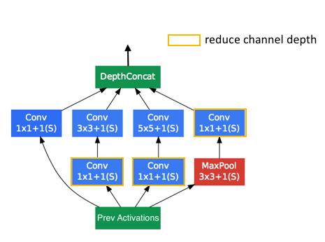
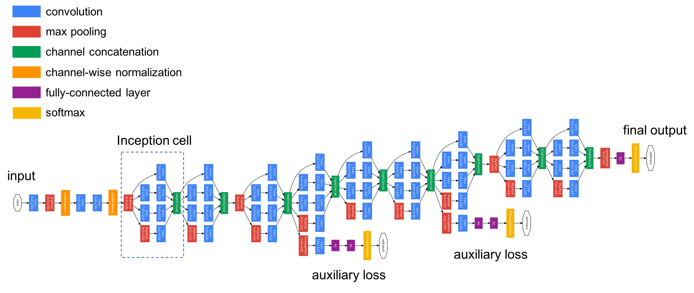
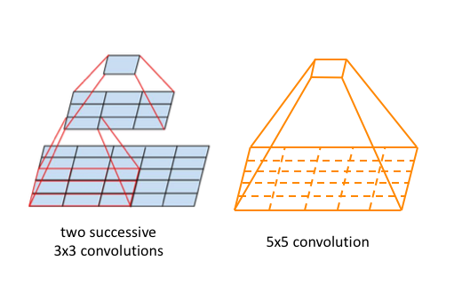
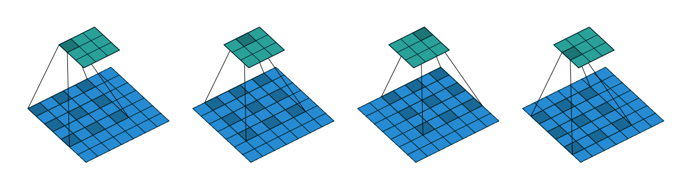
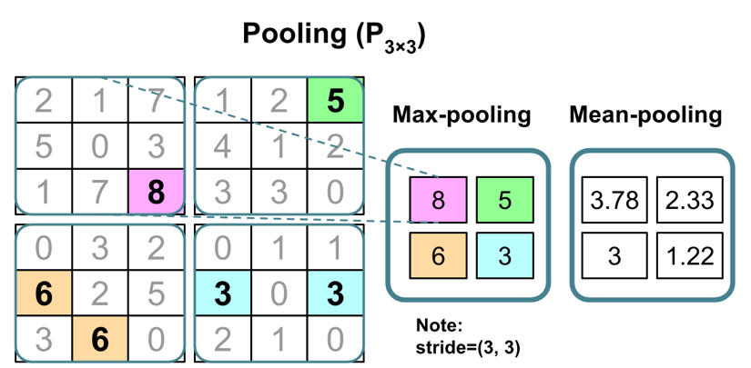
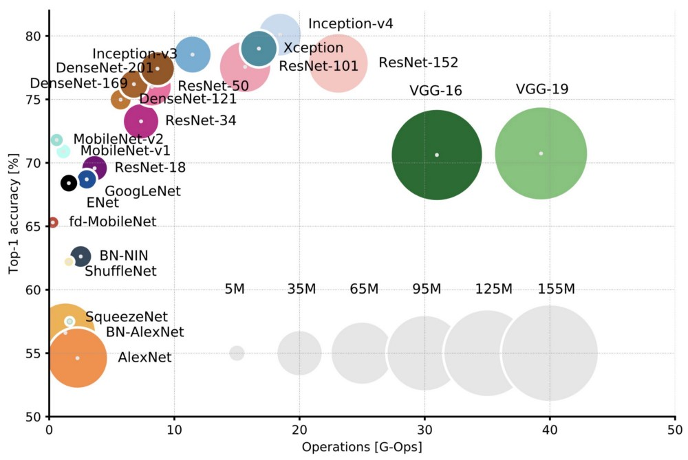
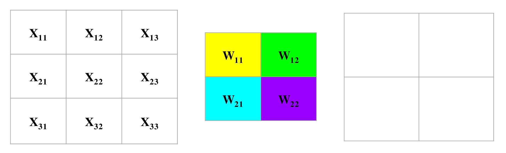
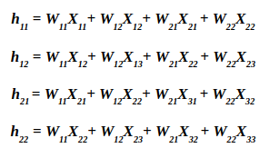
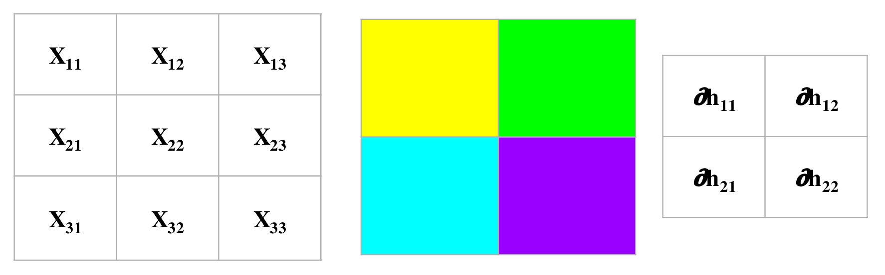
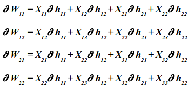

### Importing trained models and using them directly
Loading data
```python
import sys
import gzip
import shutil
import os


if (sys.version_info > (3, 0)):
    writemode = 'wb'
else:
    writemode = 'w'

zipped_mnist = [f for f in os.listdir('./')
                if f.endswith('ubyte.gz')]
for z in zipped_mnist:
    with gzip.GzipFile(z, mode='rb') as decompressed, open(z[:-3], writemode) as outfile:
        outfile.write(decompressed.read())
```
etc etc........

.........Encoding and reshaping to 4D tensor
```python
from sklearn.preprocessing import OneHotEncoder #, LabelEncoder
#label_encoder = LabelEncoder()
#y_encoded = label_encoder.fit_transform(y_train)
one_hot_encoder = OneHotEncoder(sparse=False, categories='auto')
Y_train = one_hot_encoder.fit_transform(y_train.reshape(-1,1))
Y_valid = one_hot_encoder.transform(y_valid.reshape(-1,1))
Y_test  = one_hot_encoder.transform(y_test.reshape(-1,1))

X_train_centered = X_train_centered.reshape((X_train_centered.shape[0], 28, 28, 1)) # Grayscale = 1
X_valid_centered = X_valid_centered.reshape((X_valid_centered.shape[0], 28, 28, 1))
X_test_centered  = X_test_centered.reshape((X_test_centered.shape[0], 28, 28, 1))
print(X_train_centered.shape)
print(Y_train.shape)
```

## Architectures
- Non-sequential network topology
    - Connections between non-neighbour layers (residual networks, skip-connections)
        - Possibly to all later layers (DenseNet)
    - Parallell filter groups, e.g. series of convoutions in parallel (e.g. Inception cells)
    - Extra input and/or output layers in the network
- Can be modular - blocks of convolutions used several times
- Keras Applications: pre-built, pre-trained
- Implementation requires `keras.Model` (Functional API)

### Keras functional API
```python
from tensorflow.keras.layers import Input, Dense
from tensorflow.keras.models import Model

# This returns a tensor
inputs = Input(shape=(784,)) # , dtype='int32', name='main_input')

# a layer instance is callable on a tensor, and returns a tensor
x = Dense(64, activation='relu')(inputs)
x = Dense(64, activation='relu')(x)
predictions = Dense(10, activation='softmax')(x)

# This creates a model that includes
# the Input layer and three Dense layers
model = Model(inputs=inputs, outputs=predictions)
model.compile(optimizer='rmsprop',
              loss='categorical_crossentropy',
              metrics=['accuracy'])
# model.fit(data, labels)  # starts training
```
Model: "model" SUMMARY
_________________________________________________________________
 Layer (type)                Output Shape              Param #   
=================================================================
 input_1 (InputLayer)        [(None, 784)]             0         
                                                                 
 dense (Dense)               (None, 64)                50240     
                                                                 
 dense_1 (Dense)             (None, 64)                4160      
                                                                 
 dense_2 (Dense)             (None, 10)                650       
                                                                 
=================================================================
Total params: 55,050
Trainable params: 55,050
Non-trainable params: 0
_________________________________________________________________

### Residual networks
Add activation from a layer to the pre-activation of a later layer.
![[Pasted image 20251006090055.png]]

- Imagine you are trying to model or approximate a function $H(x)$ with your neural network. 
- The network learn the difference or the "residual" between the input and the desired output. This residual is denoted as $F(x)$, where:

$F(x)=H(x)−x$

So, the network is effectively trying to learn $F(x)$ such that when it is added to the input x, we get closer to $H(x)$.

##### How it Works in ResNet:
- In ResNet, each "residual block" (a couple of layers in the network) aims to learn the residual function $F(x)$. The output of the block is then:

$F(x)+x$ . This addition is facilitated by the skip or shortcut connection, which carries $x$ over the block and adds it to the output.
- Simple Analogy: Think of it as if you are trying to teach someone a new topic. Instead of explaining everything from scratch, you first identify what they already know (the input x) and then focus on teaching what they are missing or what's different (the residual $F(x)$). This often makes the learning process more efficient.

```python
# Add a shortcut/residual to a network (ResNet)
from tensorflow.keras.layers import ReLU, Add

inputs = Input(shape=(784,))

x = Dense(64, activation='relu')(inputs)
shortcut = x           # Branch out

x = Dense(32, activation='relu')(x)
x = Dense(64)(x)       # No activation

x = Add()([shortcut, x]) # Add outputs (Make sure sizes match up)
x = ReLU()(x)
predictions = Dense(10, activation='softmax')(x)
```
![[Pasted image 20251006090716.png]]


## Batch normalization
FIX - Covariance shift problem
- Rescale activations to maintain mean and standard deviation close to 0 and 1.
- Especially useful for networks with many layers.
- Not fully understood why it has a positive effect.
![[Pasted image 20251006090800.png]]
**Example code of what a model definition could look like.**
```python
from tensorflow.keras.layers import BatchNormalization

inputs = Input(shape=(28,28,1))

x = inception_cell(inputs)
x = BatchNormalization()(x)
x = inception_cell(x)
x = BatchNormalization()(x)
x = inception_cell(x)
x = BatchNormalization()(x)
x = inception_cell(x)
x = BatchNormalization()(x)

predictions = Dense(10, activation='softmax')(x)

model = Model(inputs=inputs, outputs=predictions)
model.compile(optimizer='rmsprop',
              loss='categorical_crossentropy',
              metrics=['accuracy'])

model.summary()
```


## Building on a pretrained network
- Reuse existing networks for new/tuned purposes
    - Called applications in Keras
- Main tasks of neural networks on images:
    - Generate meaningful features
    - Combine into objects
    - Distinguish between types of objects
- Strategy:
    - Strip final dense layer(s) (softmax)
    - Freeze network parameters
    - Train new dense layers for specific purpose

### Available networks in Keras (Tensorflow 2.6)
- Xception
- VGG16
- VGG19
- ResNet (50, 101, 152; v1, v2)
- Inception V3
- Inception ResNet V2
- MobileNet (v1, v2, v3Large, v3Small)
- DenseNet (121, 169, 201)
- NASNet (Large, Mobile)
- EfficientNet (B0, ..., B7)### Available networks in Keras (Tensorflow 2.6)
- Xception
- VGG16
- VGG19
- ResNet (50, 101, 152; v1, v2)
- Inception V3
- Inception ResNet V2
- MobileNet (v1, v2, v3Large, v3Small)
- DenseNet (121, 169, 201)
- NASNet (Large, Mobile)
- EfficientNet (B0, ..., B7)

### Using
```python
from tensorflow.keras.applications import InceptionV3

conv_base = InceptionV3(weights='imagenet', # Pre-trained on ImageNet data
                  include_top=False,        # Remove classification layer
                  input_shape=(28*3, 28*3, 1*3))  # IncpetionV3 requires at least 75x75 RGB
for layer in conv_base.layers:
    layer.trainable = False
conv_base.summary(
```

##### Expanding network
```python
from tensorflow.keras.models import Sequential
from tensorflow.keras.layers import Dense, Conv2D, MaxPooling2D, Flatten, Dropout
from tensorflow.keras import Model

base_out = conv_base.output
base_out = Flatten()(base_out)
base_out = Dense(1024, activation='relu')(base_out)
base_out = Dropout(.5)(base_out)
base_out = Dense(10, activation='softmax')(base_out)
InceptionV3_model = Model(conv_base.input, base_out)

InceptionV3_model.compile(optimizer='adam',
          loss='categorical_crossentropy', 
          metrics=['accuracy'])
```

##### Update data generator with new size 
```python
from tensorflow.keras.preprocessing.image import ImageDataGenerator
datagen = ImageDataGenerator(width_shift_range=0.2,
                            height_shift_range=0.2,
                            zoom_range=0.2,
                            rotation_range=30,
                            vertical_flip=False,
                            horizontal_flip=False)
datagen.fit(X_train_centered)
train_generator = datagen.flow(np.array(X_train_centered.repeat(3,1).repeat(3,2).repeat(3,3)), np.array(Y_train), # <-- Update
                               batch_size=64)
```


### Train InceptionV3 on MNIST
~ 7m/epoch on teacher's laptop  
Needs images to be at least 75x75, i.e. larger than MNIST's 28x28, therefore .repeat(3,x)
```python
historyFlowInceptionV3 = InceptionV3_model.fit(
    train_generator,
    epochs=10, steps_per_epoch=len(X_train_centered) / 64,
    validation_data=(np.array(X_valid_centered.repeat(3,1).repeat(3,2).repeat(3,3)), np.array(Y_valid)), 
    validation_steps=len(X_valid_centered) / 64)
```

### Inception networks
- Inception cells / modules
    - Extract features on different scales, concatenate output
    - Use padding="same" to preserve sizes for concatenation
- Usually combined with bottlenecks to reduce channel depth (number of parameters)
  - Convolutional layers sum over input channels after convolution


### Inception networks - 1x1 Convolution Trick:
One might wonder: won't using multiple filters of varying sizes dramatically increase computational costs? The answer is "yes" – but here's where the Inception architecture introduces a clever trick. Before applying larger filters like 5x5, the network first reduces the depth (number of channels) of the input using 1x1 convolutions. This process, often called "bottleneck layers", compresses the information without losing too much of it, and thus reduces computational costs.

### Inception V1

~5 million parameters


### Kernel stacking
- Larger spatial filters are more expressive and able to extract features at a larger scale (larger receptive field).
- Stacking two 3x3 filters covers the same space as one 5x5 filter.
    - 5x5xc = 25c parameters vs 2 x 3x3xc = 18c parameters
- Filter stacking increases focus in the centre of the larger filters.


- Most accurate representation with linear (no) activation.
- Best performance activating (e.g. ReLU) between stacked layers too.
```python
def Conv2D_stack_n_1(x, n):
    xn = Conv2D(filters=32, kernel_size=(n,1), strides=(1,1), padding="same", activation="relu")(x)
    xn = Conv2D(filters=32, kernel_size=(1,n), strides=(1,1), padding="same", activation="relu")(xn)
    return(xn)
```

### Atrous / dilated convolutions
- Increased receptive field by spreading kernel
- Example with 3x3 kernel over 5x5 area used on 7x7 image (no padding, stride 1)
- In Keras, when using a 3×3 filter with a dilation_rate of 2×2, the kernel effectively spans a 5×5 receptive field on the input. However, the kernel retains the original 3×3 weights, so the number of parameters doesn't change, but the spatial context it captures expands.



### Max pooling revisited
- In addition to reducing dimensions:
  - Increases receptive field by size of filter
  - Multiple max pools multiply this effect


  

---
### Early stopping
- Regardless of optimisation strategy, loss may plateau
- Stopp iterations based on:
    - Minimum loss change over epochs
    - Reached certain threshold
  
### Continued optimisation
- Save weights in a model
- Continue fitting
    - Reset decay/momentum
    - Learning rate scheduling, e.g. cosine based
    - Different optimiser

## Initialization of weights
- Can be important for convergence.
- Variations of truncated normal distributions are often used (> +/-2 stddev are redrawn).
- Dense and Conv2D have the Glorut normal initializer as default:
    - Truncated normal distribution with stddev = sqrt(2 / (fan_in + fan_out)), where fan_in is the number of input units in the weight tensor and  fan_out is the number of output units in the weight tensor.
- Biases are usually initialized as 0s.
- Feature scales typically need to match weight initializations (and possible weight restrictions)
    - uint8 usually rescaled by 1/255.0

## More regularization
- We have regularized the network through dropout.
- L1 and/or L2 norm regularization can be added to kernels, biases and activatitions separately for each layer.

### Gradient Clipping
- Gradient clipping is a technique that tackles exploding gradients. The idea of gradient clipping is: If the gradient gets too large (> threshold), we rescale it to keep it small. 

## Back propagation in CNN
- **Sliding the Filter:**
When we perform a convolution, we slide the filter across the input feature map. For a given position of the filter, we get a single value in the output feature map.

- **Backpropagation through the Convolution:**
When computing the gradients, consider each position of the filter separately. For each position, you compute how the output would change with a small change to the filter value at that position.

-  **Gradient Accumulation:**
As a result of the filter sliding across the input, and being involved in the computation of many output values, the gradient for a specific weight in the filter is accumulated over all the positions where that weight was used.

### Forward pass




### Filter gradient
- Sums up local contributions (patch * output gradient)
- Each weight in the filter contributes to each pixel in the output map. Thus, any change in a weight in the filter will affect all the output pixels. 
- Thus, all these changes add up to contribute to the final loss. Thus, we can easily calculate the derivatives as follows.



![[Part 3 (IMPORTANT FOR EXAM) 2025-10-06 12.54.38.excalidraw]]

### Automatic tuning
- [Keras Tuner](https://keras-team.github.io/keras-tuner)  
- Random search over a grid/interval of hyperparameters
    - E.g. number of units, learning rate, number of layers, etc.
- Hyperband optimisation
- Bayesian optimization
- Use with care, can run for days if run too wide

## Test time augmentation
- Augmentation of images during test data prediction
- May seem counter intuitive
    - Why give the model something difficult?
- Rationale: Give the model several chances to get it correct, then average
- Simplest way: Re-use ImageDataGenerator from training data on test data
    - No re-fitting needed  
[Test Time Augmentation](https://towardsdatascience.com/test-time-augmentation-tta-and-how-to-perform-it-with-keras-4ac19b67fb4d)


## Fashion MNIST example
https://colab.research.google.com/drive/1hLWoP9P9alkso2ih5cpUi-EGX4I6teFJ?usp=sharing