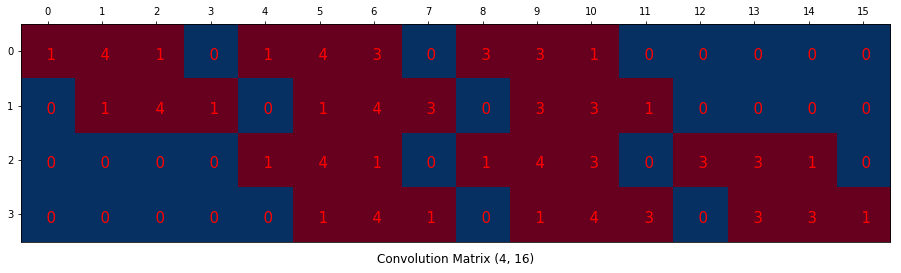

### Image classification tasks
- Classification and localization
- Object detection
  
  
### Semantic segmentation
- Assign a class to every pixel in an image
  - Identity of objects is disregarded
- Also referred to as dense prediction
- Labelling is also pixel-wise instead of image-wise
  

#### One missing building block:
## Transposed convolutions
Convolutions for:
- detecting features/patterns (stride = 1)
- down-sampling, reducing resolution (stride > 1)
- up-sampling, increasing resolution (transposed convolutions or fractional convolutions)  
  
Figures from: https://medium.com/activating-robotic-minds/up-sampling-with-transposed-convolution-9ae4f2df52d0  
Ordinary convolution:  
  
Transposed convolution:

Stretch image: (flatten)

Create kernel matrix matching number of pixels:

![[Pasted image 20251006132018.png]]
![[Pasted image 20251006132034.png]]

## Semantic Segmentation models
- Typically based on the building blocks mentioned so far in this course
- Important step forward with "Fully Convolutional Networks for Semantic Segmentation", Long et al. 2015
  - Series of convolutions and pooling blocks
  - Deconvolution/strided convolution or bilinear upsampling at the end, (possibly combining information from two or more levels) to upscale to full image size
    - tradeoff between spatially fine details and semantic precission
  - E.g. Inception V3 as basis
    - Exchange dense layers with Conv2d
    - Upscaling at the end
### Fully Convolutional Network 

### U-Net

### CODE IN PART 4.ipynb

### Other semantic segmentation networks
- V-Net for 3D imaging data
- Various architectures, not all very intuitive
  - Some take the scene into account
  - ... or even more advanced stuff
  - Many use ROIs (region of interest) as intermediate steps
  - Some use sets of atrous convolutions  
  
https://medium.com/@arthur_ouaknine/review-of-deep-learning-algorithms-for-image-semantic-segmentation-509a600f7b57

## Augmentation in semantic segmenatition
- Masks must match images
- No native support for "double" augmentation in Keras
  - Possibility: Two parallel augmentations -> zip -> yield
  - Two ImageDataGenerator-s with same seed
    - One for images
    - One for masks

## Loss functions
- Pixel-wise correctness/overlap
    - Binary/categorical cross-entropy
    - Dice coefficient
    - Binary F$_\beta$
- Boundary based
    - Hausdorff distance
- Losses for semantic segmentation: https://github.com/JunMa11/SegLoss
- https://neptune.ai/blog/image-segmentation-tips-and-tricks-from-kaggle-competitions#loss-functions
