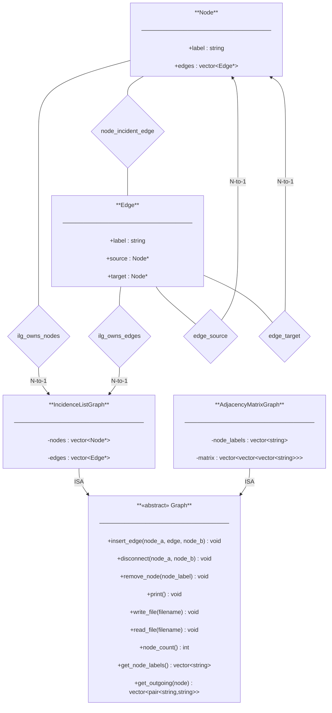

```c++
double duration = 0.0;
for(int i = 0; i < iter; i++)
{
   auto t0a = std::chrono::high_resolution_clock::now();

   …  // her skjer det eigentlege arbeidet

   auto t1a = std::chrono::high_resolution_clock::now();
   auto delta_ta = std::chrono::duration_cast<std::chrono::microseconds>(t1a-t0a).count();
   duration += 1.0e-06 * delta_ta;
}
```


ER-Diagram

# ER Diagram — oblig3

## Entity Types & Relationship Types

  

`



```

Node ◇─────ilg_owns_nodes─────▷ IncidenceListGraph

label (string) nodes : vector<Node*>

edges : vector<Edge*> edges : vector<Edge*>

"Every Node is owned by exactly one IncidenceListGraph"

N-to-1

  

Edge ◇─────ilg_owns_edges─────▷ IncidenceListGraph

label (string)

source : Node*

target : Node*

"Every Edge is owned by exactly one IncidenceListGraph"

N-to-1

  

Edge ◇─────edge_source─────▷ Node

"Every Edge has exactly one source Node"

N-to-1

  

Edge ◇─────edge_target─────▷ Node

"Every Edge has exactly one target Node"

N-to-1

  

Node ◇─────node_incident_edge─────◇ Edge

"A Node references all Edges incident on it (back-ref)"

M-to-N (no arrow — neither side is 'to-1')

```

  

### Taxonomy

  

```

Graph (abstract)

/ \

▽ ▽

IncidenceListGraph AdjacencyMatrixGraph

```

  

---

  

## Legend

  

| Symbol | Meaning |

|--------|---------|

| `◇` (hollow diamond on line) | Relationship type (forholdstype) |

| `▷` (arrowhead on line) | to-1 side of the relationship |

| No arrowhead on line | M-to-N relationship |

| `▽` (hollow triangle) | ISA / subclass (points to superclass) |